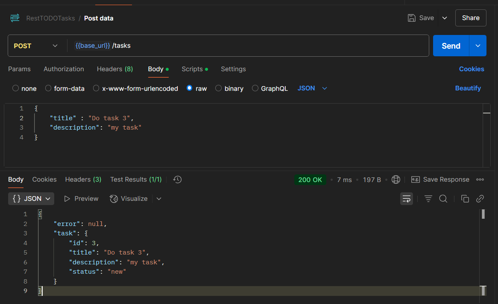
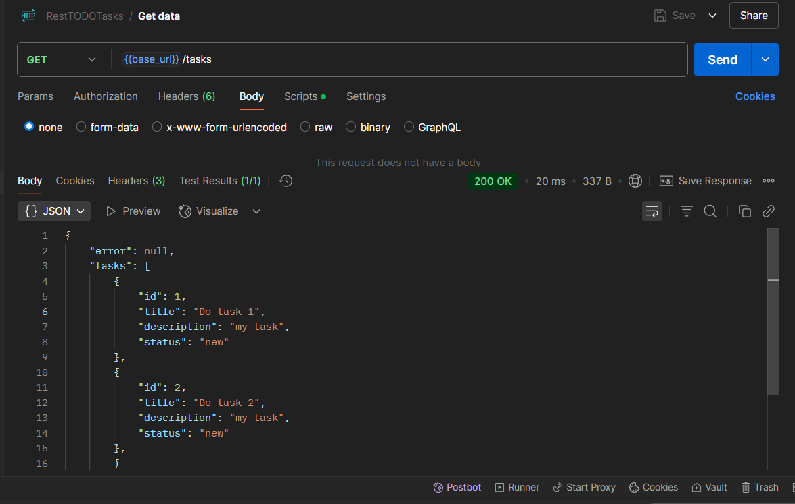
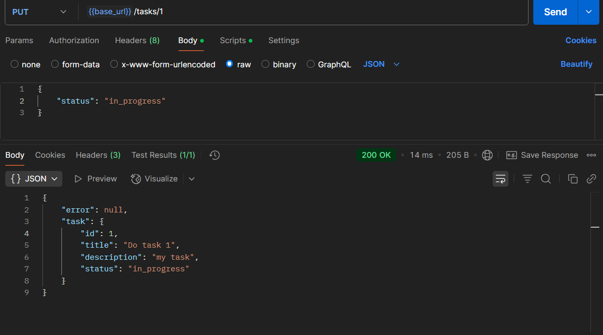
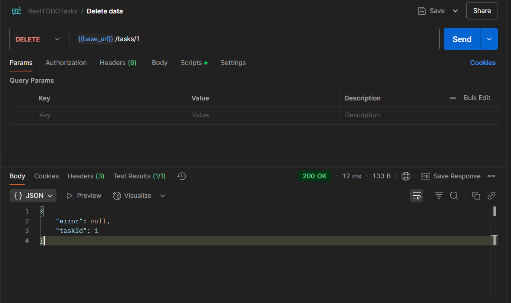
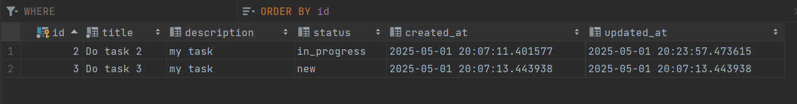

# REST TODO

REST Api сервис управления задачами.

## Запуск: ```make up```
По пути configs/config.env указаны переменные окружения для базы данных и максимальное количество подключений к бд.

В репозитории есть коллекция Postman для проверки.
## Описание:
У сервиса есть 4 эндпоинта:
* POST /tasks – создание задачи.
  * Принимает json вида: 
      ``` json
        {
            "title" : "Название задачи",
            "description": "Описание задачи"
        }
      ```
  * Возвращает json вида:
       ``` json
        {
            "error": "Ошибка",
            "task": {
                "id": "Айди задачи в базе",
                "title": "Название задачи",
                "description": "Описание",
                "status": "new"
            }
        }
      ```
    
* GET /tasks – получение списка всех задач.
  * Возвращает json вида:
     ``` json
    {
        "error": "Ошибка",
        "tasks": [
            {
              "id": "Айди задачи в базе",
              "title": "Название задачи",
              "description": "Описание",
              "status": "Статус"
            },
        ]
    }
    ```
* PUT /tasks/:id  – обновление задачи
  * Принимает json вида:
    ```json
    {
      "title" : "Название задачи(необязательное значение)",
      "description": "Описание(необязательное значение)",
      "status": "Статус(необязательное значение)"
    }
    ```
    Значения не являются обязательными, если их не передать - они будут получены из базы данных.
  * Возвращает json вида:
     ``` json
    {
        "error": "Ошибка",
        "task":{
              "id": "Айди задачи в базе",
              "title": "Название задачи",
              "description": "Описание",
              "status": "Статус"
        }
    }
    ```
* DELETE /tasks/:id – удаление задачи.
  * Возвращает json вида:
    ```json
    {
      "error": "Ошибка",
      "taskId": "айди удаленной задачи"
    }
    ```


# Скрины работоспособности:
1. POST

2. GET

3. PUT

4. DELETE

5. База данных
